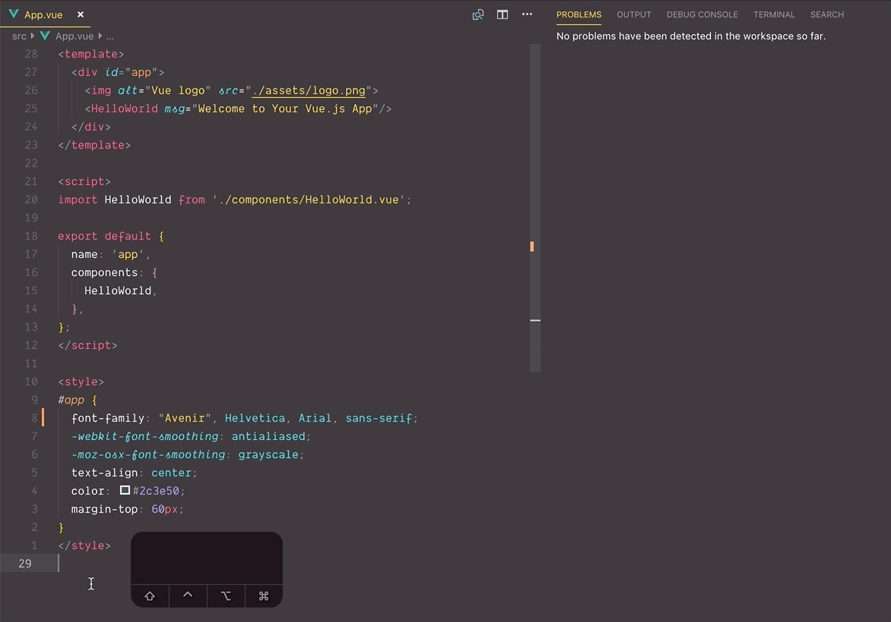
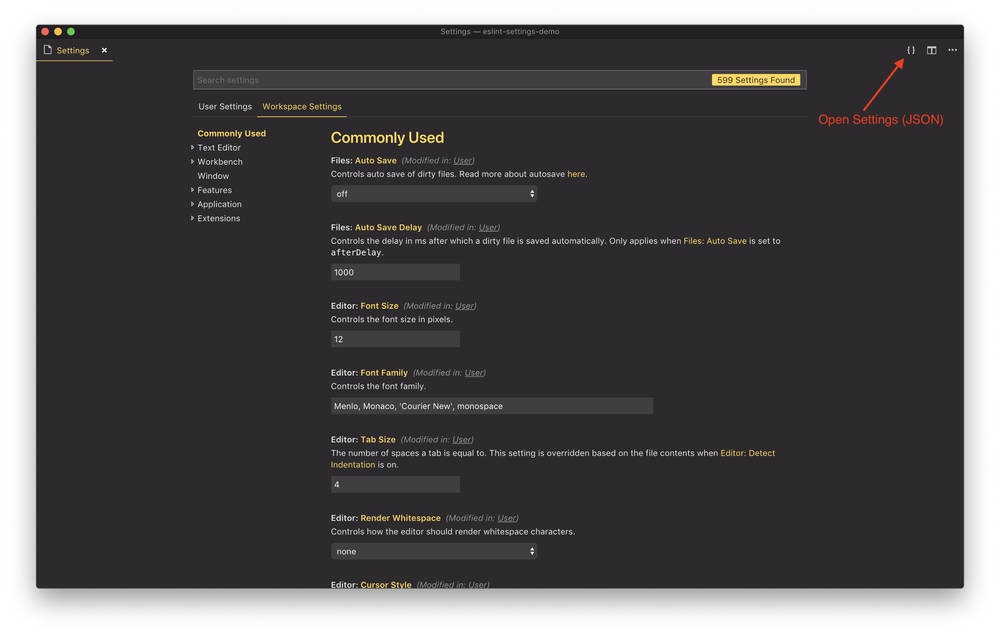

## tl;dr

Paste these settings into VS Code and have ESLint setup.

```json
// Workplace settings.json
{
  "eslint.enable": true,
  "editor.formatOnSave": true,
  "[javascript]": {
    "editor.formatOnSave": false,
  },
  "[vue]": {
    "editor.formatOnSave": false,
  },
  "eslint.autoFixOnSave": true,
  "eslint.alwaysShowStatus": true,
  "eslint.validate": [
    {
      "language": "javascript",
      "autoFix": true
    },
    {
      "language": "javascriptreact",
      "autoFix": true
    },
    {
      "language": "vue",
      "autoFix": true
    },
  ],
  "path-autocomplete.pathMappings": {
    "~": "${folder}/src",
    "@": "${folder}/src",
  }
}
```

```javascript
// .eslintrc.js
module.exports = {
  root: true,
  env: {
    node: true,
  },
  extends: [
    'plugin:vue/recommended',
    '@vue/airbnb',
  ],
  rules: {
    'no-console': process.env.NODE_ENV === 'production' ? 'error' : 'off',
    'no-debugger': process.env.NODE_ENV === 'production' ? 'error' : 'off',
    'max-len': [0],
    'import/no-extraneous-dependencies': ['error', {
      'optionalDependencies': ['test/unit/index.js']
    }],
    'import/no-unresolved': 'off',
    'no-unused-expressions': ['error', { 'allowTernary': true }],
    'no-param-reassign': 0,
    'quote-props': ['error', 'consistent'],
    // vue rules
    "vue/order-in-components": ["error", {
      "order": [
        "el",
        "name",
        "parent",
        "functional",
        ["delimiters", "comments"],
        ["components", "directives", "filters"],
        "extends",
        "mixins",
        "inheritAttrs",
        "model",
        ["props", "propsData"],
        "data",
        "computed",
        "watch",
        "LIFECYCLE_HOOKS",
        "methods",
        ["template", "render"],
        "renderError"
      ]
    }],
    'vue/html-closing-bracket-newline': ['error', {
      'singleline': 'never',
      'multiline': 'never'
    }],
    'vue/html-closing-bracket-spacing': ['error', {
      'startTag': 'never',
      'endTag': 'never',
      'selfClosingTag': 'always'
    }],
    'vue/script-indent': ['error', 2, {
      'baseIndent': 0,
      'switchCase': 1,
      'ignores': []
    }],
    'vue/max-attributes-per-line': [2, {
      'singleline': 1,
      'multiline': {
        'max': 1,
        'allowFirstLine': false
      }
    }],
  },
  parserOptions: {
    parser: 'babel-eslint',
  },
};
```

## Formatting in Visual Studio Code

I love having my text editor format my code automatically. It saves me from small errors and keeps my code looking uniform.

But every time I set up a new project, I find myself spending a few hours setting up the new project to work the same as my previous projects. This makes me feel not very productive since I’ve already gotten this set up to work for previous projects.

Especially tricky is setting things up with Vue.js apps. Since [single component files](https://vuejs.org/v2/guide/single-file-components.html) have different sections for markup, style, and script, it takes a little more configuration.

I’ve found the best approach for me is to have the ESLint [extension for VSCode](https://marketplace.visualstudio.com/items?itemName=dbaeumer.vscode-eslint) show me errors in the editor, have ESLint [set the rules for formatting](https://eslint.org/docs/rules/), and have ESLint [fix anything it can](https://eslint.org/docs/user-guide/command-line-interface#fixing-problems).

## Setup Vue.js app

At the start of a new project, I’ll use the [Vue.js CLI](https://cli.vuejs.org/) tool to scaffold everything out. Once installed, start a new project with the `create` command.

```bash
vue create <project-name>
```

For simplicity, here are the options I choose for my example project.

Pick a preset:

- Manually select features

Check the features needed for your project:

- Babel
- Linter / Formatter

Pick a linter / formatter config: (This is up to your personal preference)

- ESLint + Airbnb config

Pick additional lint features:

- Lint on save

Where do you prefer placing config for Babel, PostCSS, ESLint, etc.?

- In dedicated config files

### Side-note about Prettier

[Prettier](https://prettier.io/) just released [support for Vue.js](https://prettier.io/blog/2018/11/07/1.15.0.html), but at the time of writing, I’ve not explored the possibilities yet. Before Prettier supported Vue.js officially, I wasted several hours trying to get ESLint and Prettier to work nicely together. But the support was just not ready yet.

## Visual Studio Code Settings

By default, VS Code formats JavaScript files. If you leave this on, VS Code will try to format Vue.js files like Javascript, while ESLint will try to format it like a Vue.js file.



### Opening Workspace Settings

I normally put these settings in the workspace so that I can easily change the configuration on a project per project basis.

First, make sure you have the [ESLint plugin for VS Code installed](https://marketplace.visualstudio.com/items?itemName=dbaeumer.vscode-eslint).

Open your settings by going to Code > Preferences > Settings or by using the `cmd + ,` keyboard shortcut. The settings start off in the `User Settings` tab, change it to `Workplace Settings`.

Click on the bracket icon in the top right to view the settings page as JSON. This makes it easier to copy/paste settings in bulk.



### Add Workspace Settings

Here are my default settings for Vue.js apps:

```json
// Workplace settings.json
{
  "eslint.enable": true,
  "editor.formatOnSave": true,
  "[javascript]": {
    "editor.formatOnSave": false,
  },
  "[vue]": {
    "editor.formatOnSave": false,
  },
  "eslint.autoFixOnSave": true,
  "eslint.alwaysShowStatus": true,
  "eslint.validate": [
    {
      "language": "javascript",
      "autoFix": true
    },
    {
      "language": "javascriptreact",
      "autoFix": true
    },
    {
      "language": "vue",
      "autoFix": true
    },
  ],
  "path-autocomplete.pathMappings": {
    "~": "${folder}/src",
    "@": "${folder}/src",
  }
}
```

- `"eslint.enable": true`
- Ensures that ESLint is enabled for this project.
- `"editor.formatOnSave": true`
- Ensures that VS Code allows formatting on save.
- `"editor.formatOnSave": false,`
- For Vue.js and JavaScript files, tell the editor not to format on save. This tells the editor to not use the default formatter for this files, allowing us to use ESLints formatter.
- `"eslint.autoFixOnSave": true`
- ESLint will try to fix any issues it can on save.
- `"eslint.alwaysShowStatus": true`
- Makes sure the ESLint link in the footer is always showing. (My personal preference)
- `"eslint.validate"`
- Explicitly tell ESLint to validate JavaScript, React, and Vue files, along with allowing auto fix.
- `"path-autocomplete.pathMappings"`
- Vue.js ships with a [Webpack Configuration](https://vue-loader.vuejs.org/guide/asset-url.html#transform-rules) that adds the alias `@` to the `/src` folder. I want my [path autocomplete plugin](https://marketplace.visualstudio.com/items?itemName=ionutvmi.path-autocomplete) to recognize these alias's.

## ESLint Config

Vue.js CLI will set up the ESLint base rules when you created the project. These settings will either be in an `.eslintrc.js` file on in the `package.json` file.

I use `.eslintrc.js`, and so by default it looks something like this. (Note: there will be differences if you prefer to extend a different rule set.)

```js
// .eslintrc.js
// Out of the box rules
module.exports = {
  root: true,
  env: {
    node: true,
  },
  extends: [
    'plugin:vue/essential',
    '@vue/airbnb',
  ],
  rules: {
    'no-console': process.env.NODE_ENV === 'production' ? 'error' : 'off',
    'no-debugger': process.env.NODE_ENV === 'production' ? 'error' : 'off',
  },
  parserOptions: {
    parser: 'babel-eslint',
  },
};
```

### My ESLint Settings

I stick with [AirBnB rules](https://github.com/airbnb/javascript) mostly, besides a few exceptions.

```js
// .eslintrc.js
module.exports = {
  ...
  extends: [
    ...,
    '@vue/airbnb',
  ],
  rules: {
    'no-console': process.env.NODE_ENV === 'production' ? 'error' : 'off',
    'no-debugger': process.env.NODE_ENV === 'production' ? 'error' : 'off',
    'max-len': [0],
    'import/no-extraneous-dependencies': ['error', {
      'optionalDependencies': ['test/unit/index.js']
    }],
    'import/no-unresolved': 'off',
    'no-unused-expressions': ['error', { 'allowTernary': true }],
    'no-param-reassign': 0,
    'quote-props': ['error', 'consistent'],
  },
  ...
};
```

I also go for the [most strict rules](https://vuejs.github.io/eslint-plugin-vue/rules/#priority-c-recommended-minimizing-arbitrary-choices-and-cognitive-overhead) from the [Vue Style Guide](https://vuejs.org/v2/style-guide/).

```js
// .eslintrc.js
module.exports = {
  ...,
  extends: [
    'plugin:vue/recommended',
  ],
  rules: {
    ...
    // vue rules
    "vue/order-in-components": ["error", {
      "order": [
        "el",
        "name",
        "parent",
        "functional",
        ["delimiters", "comments"],
        ["components", "directives", "filters"],
        "extends",
        "mixins",
        "inheritAttrs",
        "model",
        ["props", "propsData"],
        "data",
        "computed",
        "watch",
        "LIFECYCLE_HOOKS",
        "methods",
        ["template", "render"],
        "renderError"
      ]
    }],
    'vue/html-closing-bracket-newline': ['error', {
      'singleline': 'never',
      'multiline': 'never'
    }],
    'vue/html-closing-bracket-spacing': ['error', {
      'startTag': 'never',
      'endTag': 'never',
      'selfClosingTag': 'always'
    }],
    'vue/script-indent': ['error', 2, {
      'baseIndent': 0,
      'switchCase': 1,
      'ignores': []
    }],
    'vue/max-attributes-per-line': [2, {
      'singleline': 1,
      'multiline': {
        'max': 1,
        'allowFirstLine': false
      }
    }],
  },
  ...
};
```

Here is my full ESLint settings that I start out with on new projects.

```js
// .eslintrc.js
module.exports = {
  root: true,
  env: {
    node: true,
  },
  extends: [
    'plugin:vue/recommended',
    '@vue/airbnb',
  ],
  rules: {
    'no-console': process.env.NODE_ENV === 'production' ? 'error' : 'off',
    'no-debugger': process.env.NODE_ENV === 'production' ? 'error' : 'off',
    'max-len': [0],
    'import/no-extraneous-dependencies': ['error', {
      'optionalDependencies': ['test/unit/index.js']
    }],
    'import/no-unresolved': 'off',
    'no-unused-expressions': ['error', { 'allowTernary': true }],
    'no-param-reassign': 0,
    'quote-props': ['error', 'consistent'],
    // vue rules
    "vue/order-in-components": ["error", {
      "order": [
        "el",
        "name",
        "parent",
        "functional",
        ["delimiters", "comments"],
        ["components", "directives", "filters"],
        "extends",
        "mixins",
        "inheritAttrs",
        "model",
        ["props", "propsData"],
        "data",
        "computed",
        "watch",
        "LIFECYCLE_HOOKS",
        "methods",
        ["template", "render"],
        "renderError"
      ]
    }],
    'vue/html-closing-bracket-newline': ['error', {
      'singleline': 'never',
      'multiline': 'never'
    }],
    'vue/html-closing-bracket-spacing': ['error', {
      'startTag': 'never',
      'endTag': 'never',
      'selfClosingTag': 'always'
    }],
    'vue/script-indent': ['error', 2, {
      'baseIndent': 0,
      'switchCase': 1,
      'ignores': []
    }],
    'vue/max-attributes-per-line': [2, {
      'singleline': 1,
      'multiline': {
        'max': 1,
        'allowFirstLine': false
      }
    }],
  },
  parserOptions: {
    parser: 'babel-eslint',
  },
};
```

## Wrapping Up

This post is mainly for me to have a place I can go and remember which settings matter so that I can always have formatting working properly when I’m doing a new Vue.js project. If it also helps you get set up, that’s fantastic! Hi five 🖐🏻!